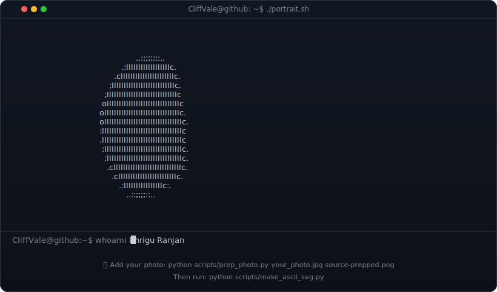

<!--
  PROFILE README — github.com/CliffVale/CliffVale
  Animated ASCII portrait + neofetch info card + contribution graph
-->

<table>
<tr>
<td valign="top"></td>
<td valign="top"></td>
</tr>
</table>

## Bhrigu Ranjan

**M.Tech Biomedical Engineering · Computational Biology · Drug Discovery**

 

<!-- animated contribution graph, refreshed daily by the workflow -->

